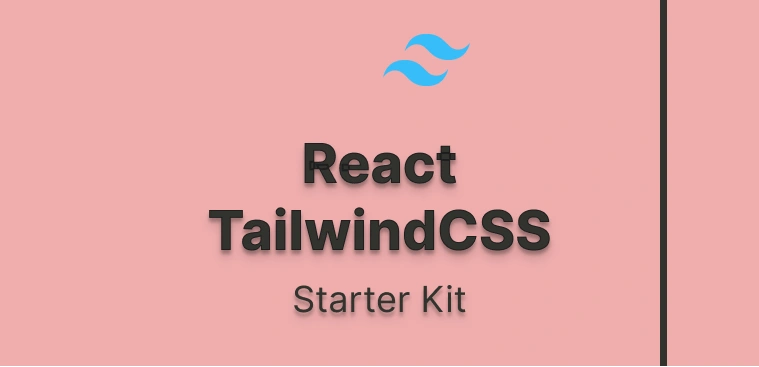

# RTSK: React - TailwindCSS Starter Kit




This template offers a streamlined setup for integrating React with Vite and TailwindCSS, providing a clean and minimalistic configuration without any unnecessary extras.

# Getting Started

## Setup Node.js and npm
- Download and install the latest version of Node.js and npm from [here](https://nodejs.org/en)

## Initialize the RTSK: React - TailwindCSS Starter Kit

### Option 1: Clone the Repository and Remove the Git History

1. **Clone the Repository**
   ```bash
   git clone git@github.com:akiko-luka/rtsk.git
   ```

2. **Navigate to the Project Directory**
   ```bash
   cd rtsk
   ```

3. **Remove the Existing Git History**
   ```bash
   rm -rf .git
   ```
   This command will delete the existing Git history, allowing you to start anew with your own Git repository.

4. **Initialize a New Git Repository**
   ```bash
   git init
   ```
   This command initializes a new Git repository for your project.

5. **Install Dependencies using npm**
   ```bash
   npm install
   ```
   This command uses npm to install the project's dependencies.

6. **Run the Development Server**
   ```bash
   npm run dev
   ```
  This command will launch the development server, allowing you to access your React application at `http://localhost:5173`.

---

### Option 2: Use Degit
Alternatively, you can use `degit` to set up the template without cloning the entire repository.

If `degit` is not installed, you can install it globally by running `npm install -g degit`.

1. **Use degit to Fetch the Template**
   ```bash
   npx degit akiko-luka/rtsk new-project
   ```
   This command fetches the template without the Git history and renames the project to `new-project`. You can substitute `new-project` with your preferred project name.

2. **Navigate to the Project Directory**
   ```bash
   cd new-project
   ```

3. **Initialize a New Git Repository**
   ```bash
   git init
   ```
   This command initializes a new Git repository for your project.

4. **Install the Dependencies using npm**
   ```bash
   npm install
   ```
   This command uses npm to install the project's dependencies.

5. **Run the Development Server**
   ```bash
   npm run dev
   ```
   This command will launch the development server, allowing you to access your React application at `http://localhost:5173`.

## Project Structure
The project structure is designed to be simple and clean, making it easy to understand and extend. Here's an overview:

```
rtsk/
|-- public/
|
|-- src/
|   |-- App.jsx
|   |-- index.css
|   |-- main.jsx
|
|-- .eslintrc.cjs
|-- .gitignore
|-- .prettierrc.json
|-- index.html
|-- package-lock.json
|-- package.json
|-- postcss.config.js
|-- README.md
|-- tailwind.config.js
|-- vite.config.js
```
- **public/:** The directory where static assets are stored.
- **src/:** The directory where the source code is stored.
    - **App.jsx:** The main React component at the root of the application.
    - **index.css:** The global styles for the application.
    - **main.jsx:** The entry point of the application.
- **.eslintrc.cjs:** The ESLint configuration.
- **.gitignore:** Specifies the files and directories that should be ignored by version control.
- **.prettierrc.json:** Prettier configuration file for code formatting rules.
- **index.html:** The application's HTML template.
- **package-lock.json:** Records exact versions of project dependencies for consistent installations.
- **package.json:** Configuration and dependencies for the project.
- **postcss.config.js:**  Configuration file for PostCSS, used to specify plugins and settings for processing CSS.
- **README.md:** Contains information about the project, including setup instructions and usage guidelines.
- **tailwind.config.js:** The configuration file for Tailwind CSS, used to customize default settings and extend its functionality.
- **vite.config.js:** Configures and optimizes the Vite build setup.

## Customization
Customize the template according to your project needs. You can add extra components, styles, or configurations as required. The aim is to maintain a minimal initial setup, giving you the flexibility to expand it as you prefer.

## Commands

- **Development Server:**

  Launch the development server with module replacement enabled.
  ```bash
  npm run dev
  ```
- **Build for Production:**

   Compile the project for production, generating optimized and minified assets in the `dist` directory.
   ```bash
   npm run build
   ```

- **Preview the Production Build:**

   Preview the locally built production version.
   ```bash
   npm run preview
   ```

## Further references

- [Vite Documentation](https://vitejs.dev/guide/)
- [React Documentation](https://react.dev/)
- [TailwindCSS Documentation](https://tailwindcss.com/docs/installation)
- [TailwindCSS Prettier](https://tailwindcss.com/blog/automatic-class-sorting-with-prettier)
- [Degit Documentation](https://www.npmjs.com/package/degit)

Enjoy coding with this streamlined React template using Vite and TailwindCSS! Your feedback and suggestions are welcome—feel free to contribute or raise issues on the [Github repository](https://github.com/akiko-luka/rtsk).